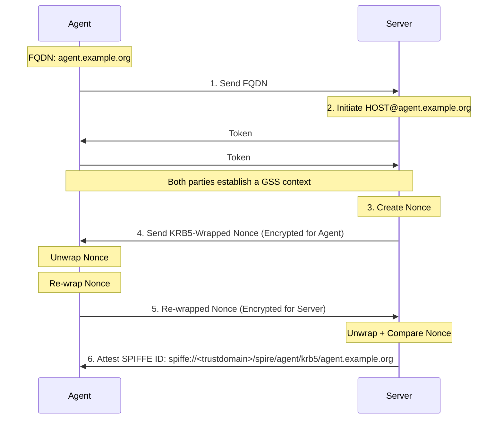

# spire-krb5-nodeattestor

SPIRE Plugins for Kerberos Node Attestation.

To add the `krb5` NodeAttestor plugin to your SPIRE server configuration, add the following to your `server.conf`

```
    NodeAttestor "krb5" {
       plugin_cmd = "/path/to/krb5-server-nodeattestor"
       plugin_data {
       }
    }
```

`agent.conf` needs to be configured to use the `krb5` NodeAttestor plugin as well:

```
    NodeAttestor "krb5" {
       plugin_cmd = "/path/to/krb5-agent-nodeattestor"
       plugin_data {
       }
    }
```

If configuration is needed it's documentated in the documentation linked below.

## Documentation

- [Server Plugin: NodeAttestor "krb5"](doc/plugin_server_nodeattestor_krb5.md)
- [Agent Plugin: NodeAttestor "krb5"](doc/plugin_agent_nodeattestor_krb5.md)

## Algorithm



1. The agent sends its FQDN to the server.
1. The server establishes a Kerberos context using HOST/agentfqdn
1. The server creates a Nonce and wraps it using the Kerberos session keys.
1. The server sends the wrapped Nonce to the agent.
1. The agent unwraps the Nonce and re-wraps sends it back to the server.
1. If the Nonce matches the server creates a SPIFFE ID for the fqdn

This works as the the server is in this model not something a traditional kerberos server would be,
but the server takes the role of a kerberos client - an initiator.

The agent can prove that he is who he is and that he has full control of the server by using the HOST@<hostname> SPN.
A normal user on the system has no access to this Service-Principal.

We don't need to add the REALM to the SPIFFE ID. As the validator - the server - is the initiator,
and Kerberos REALM mapping is normally DNS based, even on cross-realm setup, would mean that a attacker has foll
DNS ownership. Then he so or so owns the hostname anyway.